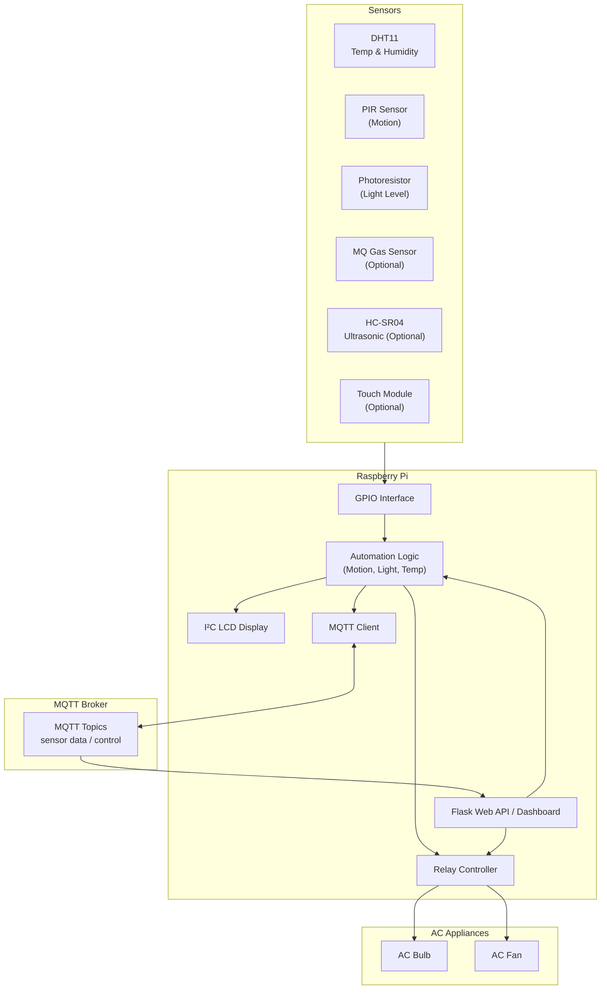

# 🏠 Smart Home Automation System

A complete IoT smart-home automation system built using **Raspberry Pi**, **Python**, **MQTT** and **Flask**.  
It integrates multiple sensors, relay-controlled **AC appliances**, and automation logic to create a functional, real-time smart home environment.

## 📸 Project Overview

This project demonstrates a fully operational **IoT home automation** system capable of:

- Monitoring **temperature & humidity** (DHT11)
- Detecting **motion** (PIR sensor)
- Measuring ambient **light level** (photoresistor)
- Automatically controlling **lights/fan** using sensors
- Controlling relays via **Flask API dashboard**
- Sending sensor data over **MQTT (Mosquitto)**
- Displaying real-time data on an **I2C LCD display**
- Running automation loops on a **Raspberry Pi**

This serves as an educational IoT system, a smart-home prototype, and an excellent base for expansion.

## 🚀 Features
### 🔌 Device Control

- Control AC bulb and AC fan through 2-channel relay module
- Local dashboard built with Flask for manual switching
- Remote control via MQTT topics

### 📡 Sensors

|Sensor | Purpose |
|--|--|
| DHT11 | Temperature & humidity monitoring |
| PIR Sensor (HC-SR501)	| Human motion detection |
| Photoresistor (LDR) | Ambient light detection |

### 🤖 Automation Logic

- Motion detected → Auto toggle the lights
- Darkness detected → Auto turn lights ON
- Brightness detected → Auto turn lights OFF
- Periodic sensor publishing (temperature, humidity, light, motion)

### 🖥️ Display

16x2 I²C LCD screen shows:
- Temperature
- Humidity
- Device status

### 🌐 Networking

- MQTT communication using **Mosquitto broker**
- REST API using **Flask**
- Real-time JSON data for web dashboards or mobile apps

## 🧱 System Architecture

<div align="center">


</div>

## 📁 Project Structure

```
project/
|-- .gitignore
|-- CHANGELOG.md
|-- LICENSE.txt
|-- README.md
|-- backend
|   |-- app.py
|   |-- requirements.txt
|   |-- static
|   |   `-- css
|   |       `-- dashboard.css
|   `-- templates
|       `-- dashboard.html
|-- device
|   |-- app
|   |   |-- actuators
|   |   |   |-- lcd_display.py
|   |   |   `-- relay.py
|   |   |-- controller.py
|   |   |-- main.py
|   |   |-- mqtt_client.py
|   |   `-- sensors
|   |       |-- dht11_sensor.py
|   |       |-- photoresistor.py
|   |       `-- pir_sensor.py
|   `-- requirements.txt
`-- docs
    `-- hardware_connections.md

```

## 🛠️ Hardware Used

Right now these modules have been added:
- Raspberry Pi (any model with GPIO)
- DHT11 temperature & humidity sensor
- PIR motion sensor
- Photoresistor (LDR)
- 2-channel relay module
- AC bulb and AC fan
- I²C 16x2 LCD display
- Breadboard + jumper wires

Optional modules supported (will be added soon):
- MQ Gas Sensor
- HC-SR04 Ultrasonic
- HW-201 / Touch Sensor
- Bluetooth Module
- Pi Camera Module

## 🔧 Installation

> **Notice**: Installation **must be done** inside the **Raspberry Pi**.

#### 1. Enable I2C (for LCD)
``` bash
sudo raspi-config
```

Enable:
- I2C
- SPI (if needed)
- Camera (if using)

#### 2. Start Mosquitto MQTT broker
``` bash
sudo systemctl start mosquitto
```

#### 2. Clone the repository
``` bash
$ git clone "https://github.com/rootminusone8004/smart_home"  
$ cd smart_home
```

#### 3. Run the programs

Open two terminals.  
In first terminal, navigate to the `device` folder.  

> **Notice**: Making a python **virtual environment** is **extremely recommended**.
>
> ``` bash
> python3 -m venv .venv --system-site-packages
> ```

``` bash
$ cd device
$ source .venv/bin/activate
$ pip install -r requirements.txt
$ python3 app/main.py
```

In second terminal, navigate to the `backend` folder.

> **Notice**: Making a python **virtual environment** is **extremely recommended**.

``` bash
$ cd backend
$ source .venv/bin/activate
$ pip install -r requirements.txt
$ python3 app.py
```

## 📡 MQTT Topics

| Topic | Payload | Description |
|--|--|--|
| `smarthome/device1/temperature`	| float	| Temperature (°C) |
| `smarthome/device1/humidity` | float | Humidity (%) |
| `smarthome/device1/light` | "bright" / "dark" | Light sensor |
| `smarthome/device1/motion` | ON / OFF | PIR detection |
| `smarthome/device1/relay1` | ON / OFF | Light relay |
| `smarthome/device1/relay2` | ON / OFF | Fan relay |

## 📈 Possible Future Enhancements
- 📷 Motion-triggered camera snapshots
- 🔊 Buzzer alarm for gas/smoke alerts
- 📱 Mobile app using Java / Kotlin
- 🌩️ Cloud integration (AWS IoT / Firebase)
- 🚪 Smart door lock integration
- 🎤 Voice control via Alexa / Google Assistant

## 🎯 Purpose
- This project was created to:
- Learn Raspberry Pi GPIO programming
- Practice IoT communication using MQTT
- Build automation logic using real sensors
- Develop a full-stack IoT system with Flask
- Create a showcase-worthy portfolio project

## ⚖️ License

This project is licensed under **MIT license**. See the [LICENSE](LICENSE.txt) file for details.
